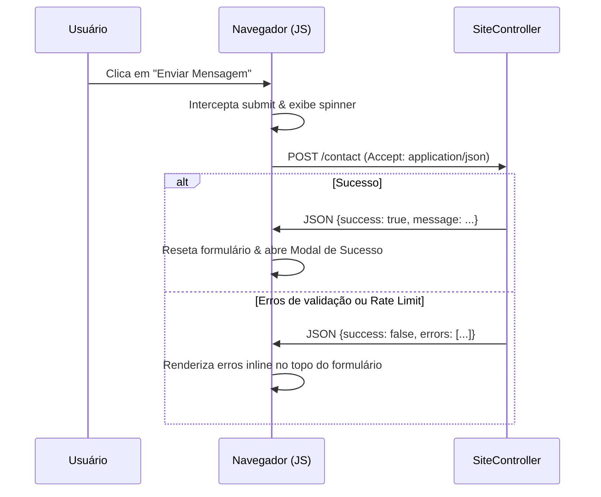

# Design: AJAX Contact Form Submission and Success Modal

Este documento descreve as mudanças para interceptar o envio do formulário de contato via AJAX, retornar JSON no controller para requisições assíncronas e renderizar um modal de sucesso com animação fluida de escala e opacidade.

---

## 🏗️ Modificações no Fluxo

### 1. Backend (`src/Public/SiteController.php`)
- Detectar se a requisição espera um retorno JSON (através dos headers `Accept`, `Content-Type` ou `X-Requested-With`).
- Retornar um payload JSON contendo os erros ou a mensagem de sucesso correspondente, finalizando a execução imediatamente.

### 2. Frontend (`templates/public/home.php`)
- Adicionar o identificador `id="contact-form"` ao formulário.
- Renderizar a estrutura de um modal de sucesso com efeito glassmorphic e posicionado de forma fixa (`fixed inset-0`).
- Adicionar scripts para realizar a chamada via `fetch` assíncrona, desabilitar e mostrar carregando no botão de envio, e manipular as classes CSS para animação suave (opacidade e escala de 95% para 100%).
- Tratar fallbacks de query strings (`?contact=sent`) caso a página seja recarregada de forma clássica.
